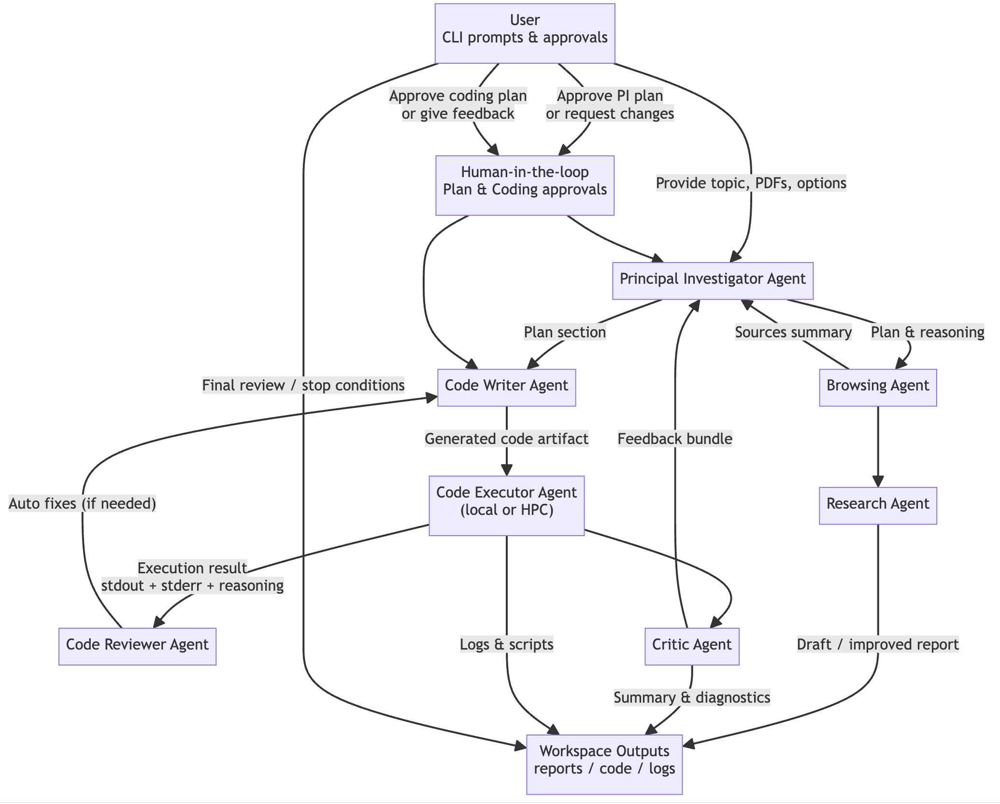

# Agentic Lab 

Agentic Lab is a multi-agent research workflow built on top of the [Academy](https://github.com/proxystore/academy) middleware. Each role (principal investigator, researcher, coding, execution, review, critic) is modeled as an asynchronous Academy `Agent`, enabling reproducible, inspectable collaboration loops and streamlined switching between local execution and HPC submissions.

## Features

- **Composable agents** – every role is its own `academy.agent.Agent`, making prompts, state, and transitions auditable.
- **Pluggable LLM backends** – configure `LLM_CONFIG` for Ollama, ALCF Sophia/Metis, or OpenRouter (e.g., `openrouter/polaris-alpha`).
- **Human-in-the-loop checkpoints** – the CLI pauses at plan/coding milestones so you can approve or demand revisions before the agents proceed.
- **Local + HPC execution** – the default `CodeExecutorAgent` runs code locally (and auto-installs missing packages); `HPCAgent` writes PBS scripts for ALCF Sophia, submits via `qsub`, polls `qstat`, and feeds log-derived reasoning back into the coding loop.
- **Persistent artifacts** – research drafts, generated code, execution transcripts, and HPC logs land under `workspace_runs/` and `output_agent/` for each timestamped run.

## Repository Layout

```
agentic_lab_academy/
├── README.md                     # You are here
├── requirements.txt / pyproject  # Python dependencies
├── main.py                       # CLI entrypoint
├── academy_agents.py             # Agent implementations (PI, Research, Coding, HPCAgent, ...)
├── workflows/orchestrator.py     # Async orchestration + human approval loop
├── models.py                     # Dataclasses shared between agents
├── prompts.py                    # Prompt builders reused from legacy Agentic Lab
├── utils.py                      # PDF/link ingestion, searches, persistence helpers
├── llm.py                        # Backend-agnostic query helpers
├── config.py                     # `LLM_CONFIG` defaults
└── workspace_runs/               # Timestamped run directories with logs, scripts, HPC outputs
```

## Agent Roles

- **User / Human Operator** – supplies the topic, artifacts (PDFs, directories, URLs), and runtime flags; approves or rejects the PI and coding plans and determines when to stop iterating.
- **Principal Investigator Agent** – converts the inputs into a multi-step execution plan and revises it when critic feedback or user requests demand changes.
- **Browsing Agent** – aggregates PDFs, file directory summaries, and quick web searches into a unified "sources" digest for the rest of the workflow.
- **Research Agent** – drafts and improves the narrative research report, grounding its text in the latest plan section and available sources.
- **Code Writer Agent** – proposes a coding plan, generates runnable scripts, and applies execution or reviewer feedback to refine the code artifact each round.
- **Code Executor Agent** – persists each script under `workspace_runs/run_<ts>/generated_code/`, runs it (optionally inside `--conda_env`), auto-installs missing packages, and captures stdout/stderr plus LLM-derived failure reasoning.
- **HPCAgent (optional)** – when `--use_hpc` is set, writes Sophia-ready PBS scripts, submits them via `qsub`, polls `qstat`, reads the resulting `hpc_job_iterXX_YY` logs, and explains cluster-side failures before triggering another coding pass.
- **Code Reviewer Agent** – inspects unsuccessful execution transcripts and proposes automated patches when the coding agent stalls.
- **Critic Agent** – consolidates research quality, code health, and executor diagnostics into feedback that seeds the next PI plan.

## Information Flow 



## Getting Started

1. **Install dependencies**

   ```bash
   pip install -r requirements.txt
   ```

2. **Configure your LLM backend** (`config.py`):
   - `ollama` for local inference (`LLM_CONFIG["source"] = "ollama"`).
   - `alcf_sophia` or `alcf_metis` for ALCF vLLM endpoints (authenticate with `python -m agentic_lab_academy.alcf_inference.inference_auth_token authenticate`).
   - `openrouter` for hosted models (export `OPENROUTER_API_KEY`, optional `OPENROUTER_SITE_URL`, `OPENROUTER_APP_NAME`).

3. **Set environment-specific knobs**
   - Provide `--conda_env` when the generated code requires a bespoke Python environment.
   - Pass `--files_dir`, `--pdfs_dir`, or `--links` so the browsing/research agents have context.


## Local vs. HPC Execution

- **Local (default)** – `CodeExecutorAgent` writes scripts to `workspace_runs/run_<ts>/generated_code/`, runs them with the provided interpreter, captures stdout/stderr, installs missing packages (with LLM-assisted package names), and supplies reasoning back to the coder or reviewer.

- **HPC (`--use_hpc`)** – `HPCAgent` takes the coding agent’s script and produces a ALCF Sophia-ready PBS submission:
  - Inserts directives such as `#PBS -A GeomicVar`, `#PBS -l select=1:system=sophia`, `#PBS -l filesystems=home:grand`, `#PBS -l walltime=01:00:00`, `#PBS -q by-gpu`.
  - Submits via `qsub`, polls `qstat` at `status_poll_interval` (default 10 s) for up to `status_max_checks` cycles, and reads the generated `hpc_job_iterXX_YY.{out,err}` logs once the job leaves the queue.
  - Uses the same execution-failure prompt as the local path to explain cluster errors, then loops with `CodeWriterAgent` until the job succeeds or the attempt budget is exhausted.

  Ensure your shell exposes `qsub`/`qstat` (source Sophia’s PBS module) before running with `--use_hpc`.

## Example Invocation

Below is a realistic command that asks the agents to perform Geneformer-style QC on two radiation-level single-cell datasets, record every required AnnData field, and produce QC artifacts. Tweak paths to match your environment.

```bash
python -m agentic_lab_academy.main \
  --mode code_only \
  --conda_env /lus/grand/projects/GeomicVar/tarak/Geneformer_gene46100/Geneformer/geneformer_gene46100_env \
  --files_dir /grand/GeomicVar/tarak/ai_codes/agentic_lab/GSE255800_extracted \
  --topic "I want to perform quality control on single-cell datasets exposed to low-dose radiation. Load the two samples in the directory /grand/GeomicVar/tarak/ai_codes/agentic_lab/GSE255800_extracted (GSM8080315 labeled as obs['radiation_level'] = 'control' and GSM8080317 labeled as obs['radiation_level'] = 'r100') and concatenate them into a single AnnData object. Map all genes to Ensembl IDs using the provided GENCODE v47 GTF file, keeping only protein-coding and miRNA biotypes. Ensure that adata.var['ensembl_id'] exists and is correctly populated because later steps require it, and also ensure that adata.obs['n_counts'] exists and contains each cell’s total read count. Apply Geneformer-style QC filtering by keeping cells within 3 standard deviations of the dataset mean for total counts and mitochondrial percentage, and by requiring more than seven detected protein-coding or miRNA Ensembl genes; verify that enough cells remain after filtering. List ALL fields that must exist in adata at every step before generating code. Finally generate violin plots for n_genes_by_counts, total_counts, and pct_counts_mt, saving the cleaned AnnData object as results/qc_filtered_radiation.h5ad, the QC violin plots as results/qc_violins.pdf or .png, and a QC summary CSV at results/qc_stats.csv." \
```

During the run you will:

1. Approve (or edit) the PI’s research plan.
2. Approve (or edit) the coding plan.
3. Review execution logs (local or HPC) and decide when to stop iterating.

Artifacts can be found under `workspace_runs/run_<timestamp>/` (conversation logs, generated code, HPC scripts/logs) and `output_agent/iteration_<n>.{md,py,txt}` for consolidated reports.

## Tips & Troubleshooting

- **LLM tokens** – `llm.py` tracks total token usage; inspect `workspace_runs/run_<ts>/conversation_log_<ts>.jsonl` for per-agent exchanges.
- **HPC debugging** – If HPCAgent marks a job as failed, open the referenced `hpc_job_iterXX_YY.out/err` files for the full stack trace. The reasoning text shown in the CLI is already fed back into the coding agent for automatic retries.
- **Custom PBS settings** – adjust `HPCAgent._DEFAULT_OPTIONS` in `academy_agents.py` (queue, walltime, `modules`, etc.) or extend the CLI to pass your preferred overrides.
- **Extending agents** – prompts live in `prompts.py`; adjust temperatures or prompt templates in `config.py` and `academy_agents.py` as needed.

# To add:

1. BioMCP integration for hypothesis generation 